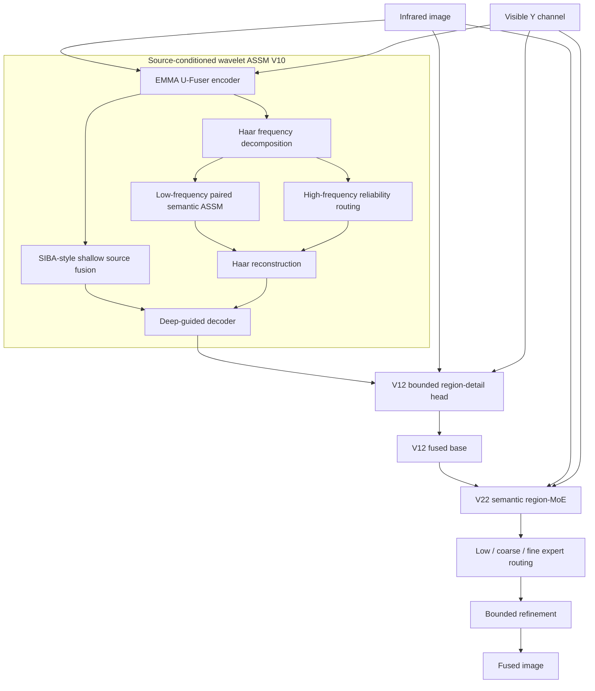

# SCPR-Net V22 Architecture

V22 使用完整的 V10 → V12 → semantic region-MoE 级联。发布仓库保留了该运行路径会导入的全部网络源码；没有修改原文件或为了项目名重命名类。

## Forward path



## Primary implementation files

| Stage | Implementation | Main classes/functions |
|---|---|---|
| V22 top level | [`code/nets/Ufuser_region_moe_v19.py`](code/nets/Ufuser_region_moe_v19.py) | `UfuserRegionMoEV19`, `SemanticRegionMoE`, `lowpass`, `detail` |
| V12 detail stage | [`code/nets/Ufuser_v10_region_detail_v12.py`](code/nets/Ufuser_v10_region_detail_v12.py) | `UfuserV10RegionDetailV12`, `RegionParetoDetailHead` |
| V10 backbone | [`code/nets/Ufuser_source_wave_assm_v10.py`](code/nets/Ufuser_source_wave_assm_v10.py) | `UfuserSourceWaveASSMV10`, `SourceWaveASSMFusion`, `ReliabilityHighBandFusion`, `SourcePrompt` |
| Base U-Fuser | [`code/nets/Ufuser.py`](code/nets/Ufuser.py) | `Ufuser`, Restormer/CNN encoder–decoder blocks |
| ASSM selective scan | [`code/nets/assm_mambairv2.py`](code/nets/assm_mambairv2.py) | `SelectiveScanASE`, `ASSM2D`, `ASSMResidual` |
| Paired semantic fusion | [`code/nets/Ufuser_end2end_v7.py`](code/nets/Ufuser_end2end_v7.py) | `PairedSemanticASSMFusion`, `SIBAShallowFusion` |
| Frequency transforms | [`code/nets/Ufuser_pareto_v6.py`](code/nets/Ufuser_pareto_v6.py) | `haar_dwt`, `haar_iwt`, high/low-frequency branches |
| Common/private fusion | [`code/nets/Ufuser_pareto_assm_v8.py`](code/nets/Ufuser_pareto_assm_v8.py) | `ExactCommonPrivateFusion`, `DeepSemanticHead` |

## Required supporting network modules

The preserved imports also include:

- `joint_assm_v3.py`: joint cross-modal ASSM and common/private adapter.
- `Ufuser_assm_ship_task_v2.py`: ASSM/CNN, modality adapter and resize blocks.
- `Ufuser_joint_assm_ship_v3.py`: guided skip and private fusion blocks.
- `Ufuser_safm_v5.py`: source attention and state-space building blocks used by the dependency chain.
- `ship_high_order.py`: spatial/channel high-order interaction.
- `fusion_losses_v2.py`, `v3.py`, `v4.py`, `v6.py`, `v8.py`, `v14.py`, `v19.py`: objectives imported by the preserved V22 training path.

## Checkpoint construction

The final `EMMA_REGION_MOE_V22.ckpt` stores the top-level V22/region-MoE state. Model construction also needs the V12 state and V10 configuration checkpoint:

```text
EMMA_SOURCE_WAVE_ASSM_V10_SCREEN_best_pareto.ckpt
                    ↓ configuration
EMMA_V10_REGION_DETAIL_V12_FIXED_STRONG.ckpt
                    ↓ backbone/state
EMMA_REGION_MOE_V22.ckpt
                    ↓
             SCPR-Net V22
```

Run the portable constructor and inference loop with `tools/infer_scpr.py`; it avoids the original training-machine paths embedded in checkpoints without editing any supplied model source or checkpoint.
