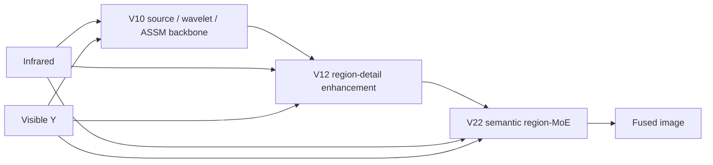

<div align="center">

# SCPR-Net

### Spatial-Semantic Cross-Modal Prompt Routing Network

**Source-aware · Frequency-decoupled · Region-adaptive infrared–visible image fusion**

[](MODEL_ZOO.md)
[](environment.yml)
[](environment.yml)
[](environment.yml)
[](SNAPSHOT_SHA256SUMS)

[Architecture](ARCHITECTURE.md) · [Reproduction](REPRODUCIBILITY.md) · [Model Zoo](MODEL_ZOO.md) · [Figures](#complete-figure-collection) · [Citation](#citation)

</div>

<p align="center">
  
</p>

## Overview

SCPR-Net 面向红外–可见光图像融合，在统一网络中组织源条件提示、跨模态交互、频率解耦和空间语义区域路由。当前发布以 **V22** 为唯一主模型，并提供完整推理权重链、可执行入口、环境锁定、指标代码和 SHA-256 完整性校验。

> **Code integrity.** `code/` 中所有保留源码均从原工作目录逐字节复制，未重命名、未格式化、未修改。V22 延续源码中的 `UfuserRegionMoEV19` 类名；`EMMA_REGION_MOE_V22.ckpt` 是该结构继续训练后选出的最佳模型。

### Highlights

| Component | Role |
|---|---|
| **Source-aware shallow interaction** | 以原始红外/可见光输入生成 source queries，在浅层进行双向跨模态交互。 |
| **Frequency-decoupled deep fusion** | Haar 分解后分别处理低频结构与高频细节，低频采用 paired semantic ASSM，高频采用可靠性路由。 |
| **Region-adaptive detail enhancement** | 在 V10 主干之上，通过有界区域细节头增强局部强响应并限制不稳定漂移。 |
| **Spatial-semantic multi-frequency routing** | V22 对 low/coarse/fine 三个频带分别在红外、可见光和 V12 基线专家之间进行语义条件路由。 |

## Architecture

### Full network

<p align="center">
  
</p>

### Source-query and frequency-collaboration modules

<p align="center">
  
</p>



网络源码已完整保存在 [`code/nets/`](code/nets/)；逐模块类名、前向路径和权重构建关系见 [ARCHITECTURE.md](ARCHITECTURE.md)。

## Quick Start

### 1. Environment

推荐 Linux、NVIDIA GPU 与 CUDA 12.1：

```bash
conda env create -f environment.yml
conda activate scpr-net
python -m pip install --no-build-isolation -r requirements-mamba.txt
```

`mamba-ssm` 依赖 CUDA 扩展，应在 PyTorch 与 CUDA 环境确认可用后安装。

### 2. Verify the release

```bash
python tools/verify_snapshot.py
```

校验覆盖 V22 源码、3 个权重、测试图和原始论文图片。成功时输出：

```text
Snapshot verified: 53 file(s)
```

### 3. Run V22 inference

```bash
python tools/infer_scpr.py \
  --model code/model/EMMA_REGION_MOE_V22.ckpt \
  --v12-model code/model/EMMA_V10_REGION_DETAIL_V12_FIXED_STRONG.ckpt \
  --v10-model code/model/EMMA_SOURCE_WAVE_ASSM_V10_SCREEN_best_pareto.ckpt \
  --ir-dir code/test_img/ir \
  --vi-dir code/test_img/vi \
  --output-dir outputs/scpr-net \
  --device cuda
```

输入红外图与可见光图必须同名、同尺寸。可见光图转换为 Y 通道，输出为灰度融合图；支持 PNG、JPG、JPEG、BMP、TIF 和 TIFF。

## Experimental Results

### Quantitative comparison on MSRS

<p align="center">
  
</p>

### Frequency-routing response analysis

<p align="center">
  
</p>

### Feature evolution

<p align="center">
  
</p>

### Prototype-guidance and frequency-branch analysis

<p align="center">
  
</p>

### Qualitative comparisons

<p align="center"></p>

<p align="center"></p>

<p align="center"></p>

<p align="center"></p>

<p align="center"></p>

### Semantic and regional analysis

<p align="center"></p>

<p align="center"></p>

## Complete Figure Collection

原目录 `E:\24696\桌面\emma\图片` 中的 **17 个文件已全部上传并全部收录在本 README**：14 个 PNG 在上方直接展示，3 个 PDF 原件在下方提供可点击入口。文件名、内容和 SHA-256 均保持不变。

| PDF original | Preview/source |
|---|---|
| Frequency-routing response | [`00004N_frequency_routing_enhancement.pdf`](assets/figures/00004N_frequency_routing_enhancement.pdf) |
| Figure 5 vector/high-resolution original | [`图片5.pdf`](assets/figures/图片5.pdf) |
| Figure 6 vector/high-resolution original | [`图片6.pdf`](assets/figures/图片6.pdf) |

<details>
<summary><strong>Exact asset checklist (17/17)</strong></summary>

- `00004N_frequency_routing_enhancement.png`
- `00004N_frequency_routing_enhancement.pdf`
- `feature_evolution_00581D.png`
- `MSRS_quantitative_comparison_roman.png`
- `图片1.png`
- `图片3.png`
- `图片4.png`
- `图片5.png`
- `图片5.pdf`
- `图片6.png`
- `图片6.pdf`
- `图片7.png`
- `图片8.png`
- `图片9.png`
- `图片10.png`
- `图片11.png`
- `图片12.png`

</details>

## Repository Layout

```text
SCPR-Net/
├── code/
│   ├── nets/                  # V22 complete network dependency closure
│   ├── repro/                 # training, inference and evaluation sources
│   ├── model/                 # V10 → V12 → V22 checkpoint chain
│   └── test_img/              # three aligned IR/visible test pairs
├── assets/figures/            # all 17 supplied PNG/PDF files
├── tools/infer_scpr.py        # portable V22 constructor and inference
├── tools/verify_snapshot.py   # SHA-256 verification
├── ARCHITECTURE.md            # implementation-level architecture map
├── REPRODUCIBILITY.md         # environment, data, training and evaluation
├── MODEL_ZOO.md               # checkpoint roles and sizes
└── SNAPSHOT_SHA256SUMS        # immutable snapshot manifest
```

## Reproducibility Notes

- 固定环境：Python 3.10、PyTorch 2.2.2、CUDA 12.1。
- 默认随机种子：`3407`。
- 最终权重：`EMMA_REGION_MOE_V22.ckpt`。
- 便携入口显式加载 V10 → V12 → V22，规避训练 checkpoint 中的原机器绝对路径。
- GitHub Actions 自动进行快照哈希与 Python 语法检查。
- Ai/Av、EMMA 基线、旧 V19 权重、日志、生成结果和未被 V22 运行路径导入的第三方仓库副本未上传。

完整说明见 [REPRODUCIBILITY.md](REPRODUCIBILITY.md)。

## Citation

SCPR-Net 基于 EMMA（CVPR 2024）继续研究。使用本仓库时，请保留项目链接并引用基础工作：

```bibtex
@InProceedings{Zhao_2024_CVPR,
  author    = {Zhao, Zixiang and Bai, Haowen and Zhang, Jiangshe and Zhang, Yulun and Zhang, Kai and Xu, Shuang and Chen, Dongdong and Timofte, Radu and Van Gool, Luc},
  title     = {Equivariant Multi-Modality Image Fusion},
  booktitle = {Proceedings of the IEEE/CVF Conference on Computer Vision and Pattern Recognition},
  year      = {2024}
}
```

## Acknowledgements & License

本项目继承 EMMA 及相关研究实现中的思想与组件，来源说明见 [NOTICE.md](NOTICE.md)。当前快照不擅自新增许可证；使用、修改或再发布前，请核对相应权利人的许可条款。

<div align="center">

**SCPR-Net · V22 reproducible release**

</div>
