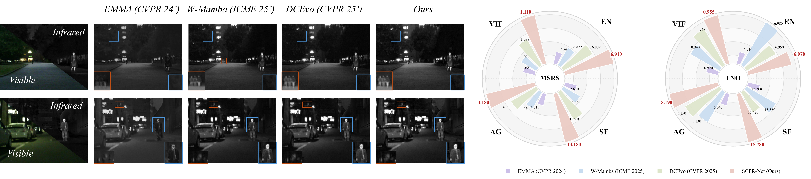
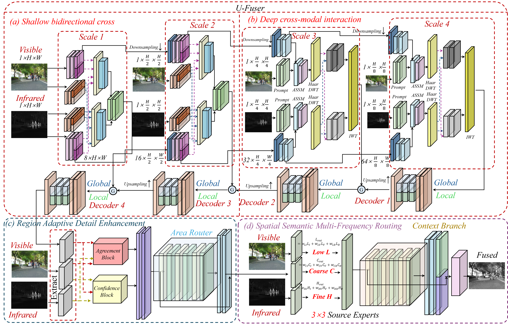
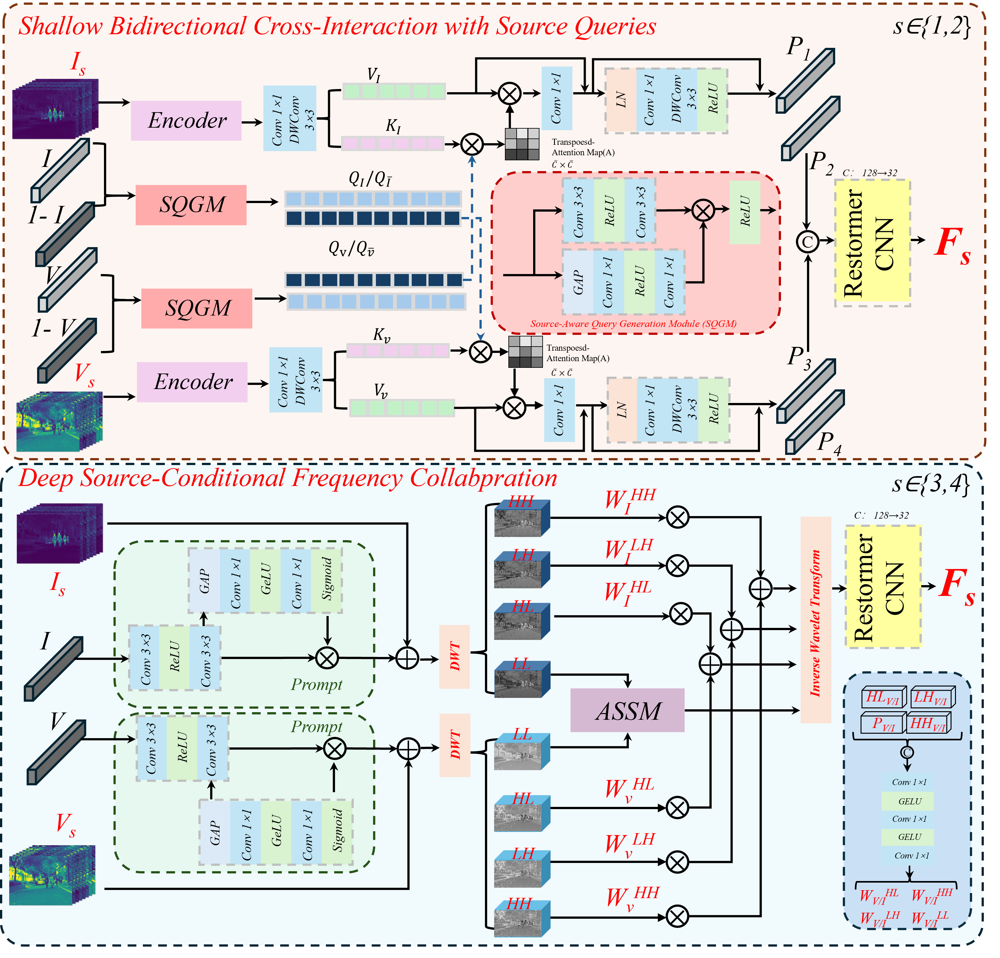
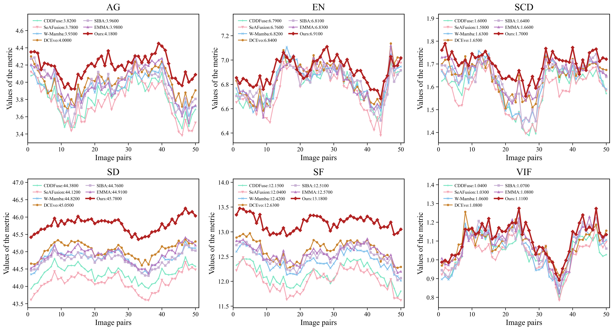
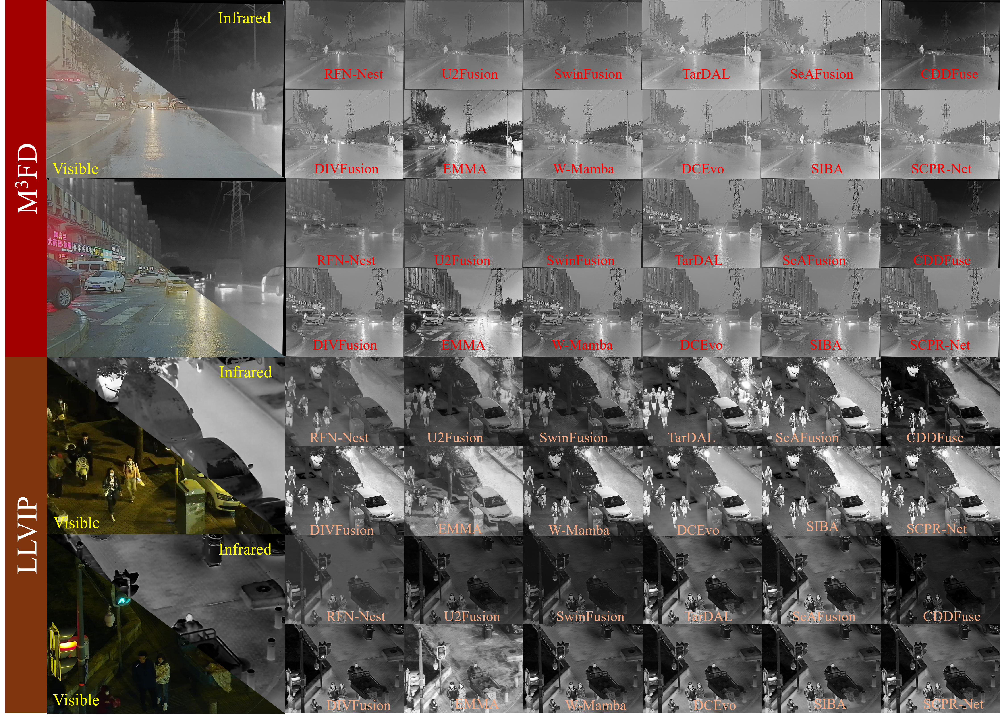
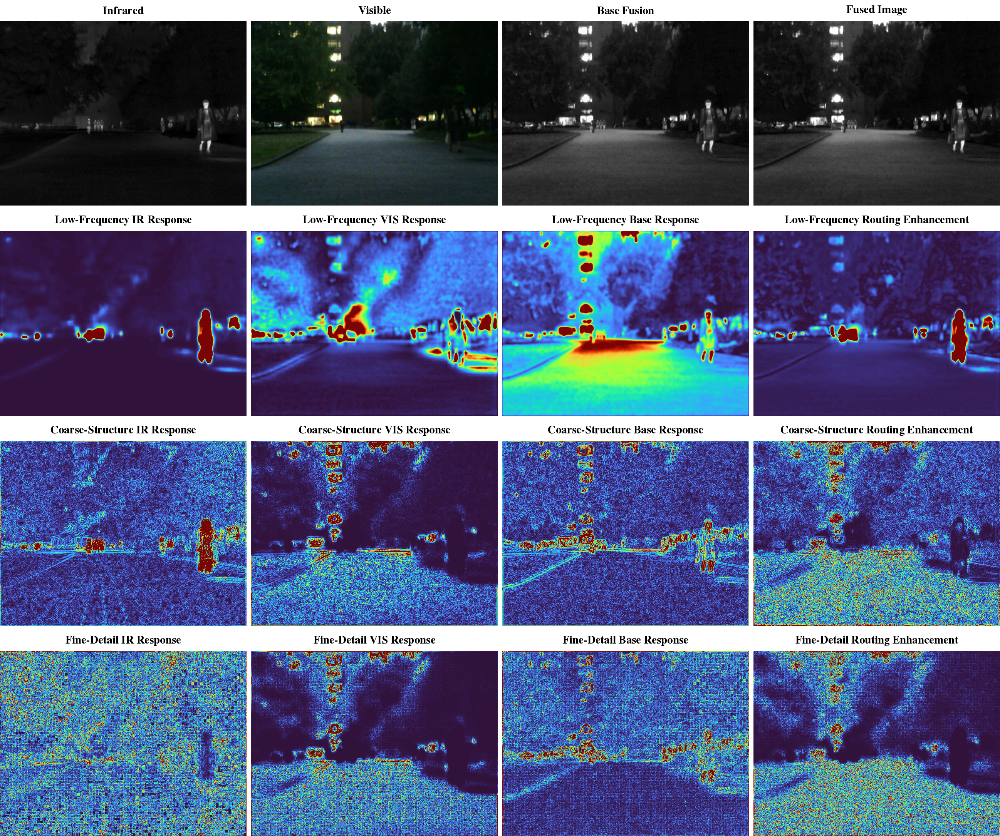
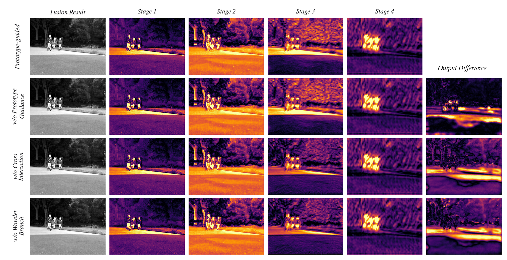
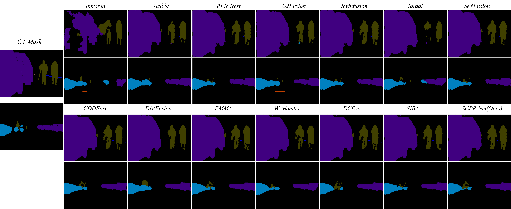

<div align="center">

# SCPR-Net

### Spatial–Semantic Cross-Modal Prompt Routing Network

**Source-aware · Frequency-decoupled · Region-adaptive infrared–visible image fusion**

[](environment.yml)
[](environment.yml)
[](environment.yml)
[](MODEL_ZOO.md)
[](SNAPSHOT_SHA256SUMS)

[Architecture](ARCHITECTURE.md) · [Reproducibility](REPRODUCIBILITY.md) · [Model Zoo](MODEL_ZOO.md) · [Datasets](#datasets) · [Citation](#citation)

</div>

<p align="center">
  
</p>

## Overview

SCPR-Net organizes source-conditional prompting, cross-modal interaction, frequency decoupling, and spatial-semantic region routing in a unified network for infrared–visible image fusion. The release provides the **V22** model with a complete inference-weight chain, a portable entry point, a pinned environment, metric evaluation code, and SHA-256 integrity verification.

| Component | Role |
|---|---|
| **Source-aware shallow interaction** | Generates source queries from raw IR/visible inputs for bidirectional cross-modal interaction in shallow layers. |
| **Frequency-decoupled deep fusion** | Haar decomposition separates low-frequency structure from high-frequency detail; paired semantic ASSM handles the former, reliability routing the latter. |
| **Region-adaptive detail enhancement** | Bounded region detail head built on the V10 backbone strengthens local responses while limiting unstable drift. |
| **Spatial-semantic multi-frequency routing** | V22 routes low/coarse/fine frequency bands between infrared, visible, and V12 baseline experts under semantic conditions. |

## Architecture

<p align="center">
  
</p>

<p align="center">
  
</p>

The full dependency closure of the network source is preserved in [`code/nets/`](code/nets/); per-module class names, forward paths, and weight-construction relationships are documented in [ARCHITECTURE.md](ARCHITECTURE.md).

## Quick Start

### 1. Environment

Linux with an NVIDIA GPU and CUDA 12.1 is recommended.

```bash
conda env create -f environment.yml
conda activate scpr-net
python -m pip install --no-build-isolation -r requirements-mamba.txt
```

`mamba-ssm` compiles CUDA extensions; install it after PyTorch and the CUDA toolkit are confirmed available.

### 2. Verify the release

```bash
python tools/verify_snapshot.py
```

Checks the V22 source, three checkpoints, test images, and original paper figures. Expected output:

```text
Snapshot verified: 53 file(s)
```

### 3. Run V22 inference

```bash
python tools/infer_scpr.py \
  --model code/model/EMMA_REGION_MOE_V22.ckpt \
  --v12-model code/model/EMMA_V10_REGION_DETAIL_V12_FIXED_STRONG.ckpt \
  --v10-model code/model/EMMA_SOURCE_WAVE_ASSM_V10_SCREEN_best_pareto.ckpt \
  --ir-dir code/test_img/ir \
  --vi-dir code/test_img/vi \
  --output-dir outputs/scpr-net \
  --device cuda
```

Infrared and visible images must share the same filename and resolution. The visible image is converted to its Y channel and the output is a grayscale fused image. PNG, JPG, JPEG, BMP, TIF, and TIFF are supported.

## Datasets

The model is evaluated on five public infrared–visible benchmark datasets. All data are obtained from the official sources below, which include the standard test splits.

| Dataset | Modalities | Pairs | Evaluation | Official source |
|---|---|---|---|---|
| **MSRS** | IR + Visible | 1,444 | Quantitative, semantic segmentation | [github.com/Linfeng-Tang/MSRS](https://github.com/Linfeng-Tang/MSRS) |
| **TNO** | IR + Visible | multi-scene night-time | Quantitative | [figshare.com (TNO Image Fusion Dataset)](https://figshare.com/articles/dataset/TNO_Image_Fusion_Dataset/1008029) |
| **RoadScene** | IR + Visible | 221 | Qualitative | [github.com/hanna-xu/RoadScene](https://github.com/hanna-xu/RoadScene) |
| **M³FD** | IR + Visible | 4,200 | Qualitative, object detection | [github.com/JinyuanLiu-CV/TarDAL](https://github.com/JinyuanLiu-CV/TarDAL) |
| **LLVIP** | IR + Visible | 15,488 | Qualitative | [bupt-ai-cz.github.io/LLVIP](https://bupt-ai-cz.github.io/LLVIP/) |

Refer to [REPRODUCIBILITY.md](REPRODUCIBILITY.md) for the exact directory layout and evaluation protocol.

## Experimental Results

### Quantitative comparison on MSRS

<p align="center">
  
</p>

### Qualitative comparison across five datasets

<p align="center">
  
</p>

<p align="center">
  
</p>

### Analysis

<p align="center">
  
</p>

<p align="center">
  
</p>

<p align="center">
  
</p>

<p align="center">
  
</p>

<p align="center">
  
</p>

## Repository Layout

```text
SCPR-Net/
├── code/
│   ├── nets/                  # V22 complete network dependency closure
│   ├── repro/                 # training, inference, and evaluation sources
│   ├── model/                 # V10 → V12 → V22 checkpoint chain
│   └── test_img/              # three aligned IR/visible test pairs
├── assets/figures/            # figures used in this README
├── tools/infer_scpr.py        # portable V22 constructor and inference
├── tools/verify_snapshot.py   # SHA-256 verification
├── ARCHITECTURE.md            # implementation-level architecture map
├── REPRODUCIBILITY.md         # environment, data, training, and evaluation
├── MODEL_ZOO.md               # checkpoint roles and sizes
└── SNAPSHOT_SHA256SUMS        # immutable snapshot manifest
```

## Reproducibility

- Pinned environment: Python 3.10, PyTorch 2.2.2, CUDA 12.1.
- Default random seed: `3407`.
- Final weights: `EMMA_REGION_MOE_V22.ckpt`.
- The portable entry point loads the V10 → V12 → V22 chain explicitly, bypassing absolute paths baked into the training checkpoints.
- Snapshot hashes and Python syntax are checked automatically in CI.

See [REPRODUCIBILITY.md](REPRODUCIBILITY.md) for the full protocol.

## Citation

SCPR-Net is a continuation of [EMMA](https://arxiv.org/abs/2305.11443) (CVPR 2024). Please cite the base work when using this repository:

```bibtex
@InProceedings{Zhao_2024_CVPR,
  author    = {Zhao, Zixiang and Bai, Haowen and Zhang, Jiangshe and Zhang, Yulun and Zhang, Kai and Xu, Shuang and Chen, Dongdong and Timofte, Radu and Van Gool, Luc},
  title     = {Equivariant Multi-Modality Image Fusion},
  booktitle = {Proceedings of the IEEE/CVF Conference on Computer Vision and Pattern Recognition},
  year      = {2024}
}
```

## Acknowledgements & License

Ideas and components are inherited from EMMA and related research; source attribution is documented in [NOTICE.md](NOTICE.md). This snapshot does not introduce a new license — verify the terms of the respective right holders before use, modification, or redistribution.

<div align="center">
  <b>SCPR-Net · V22 reproducible release</b>
</div>
