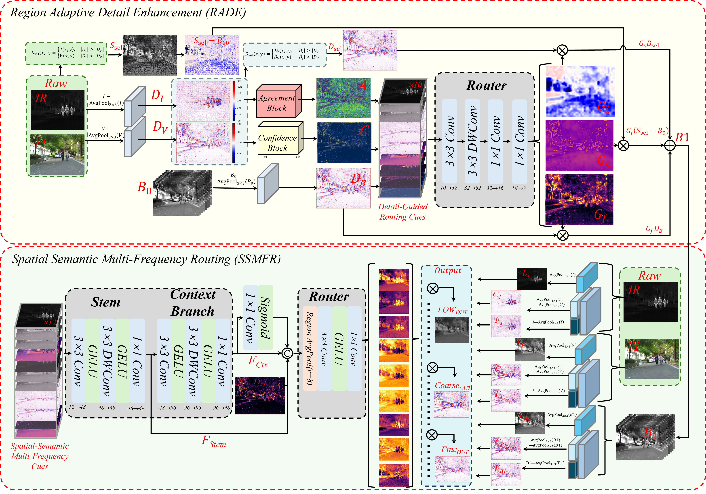
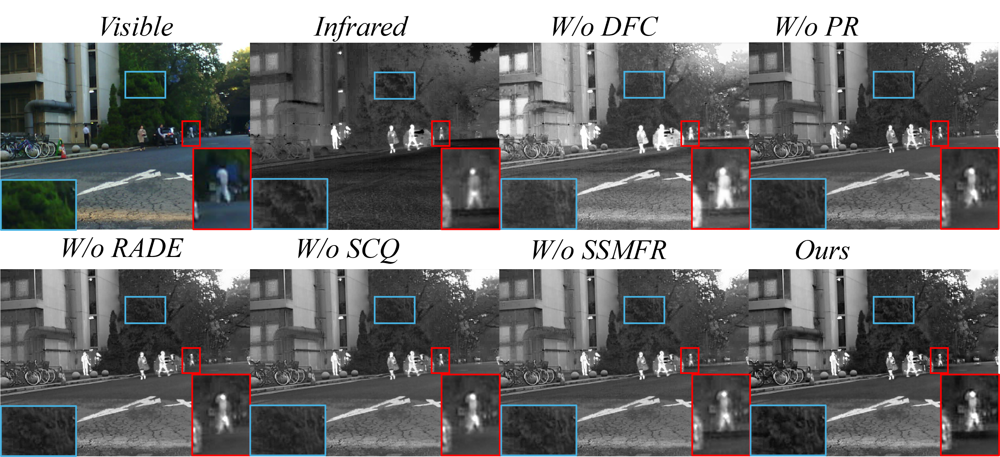
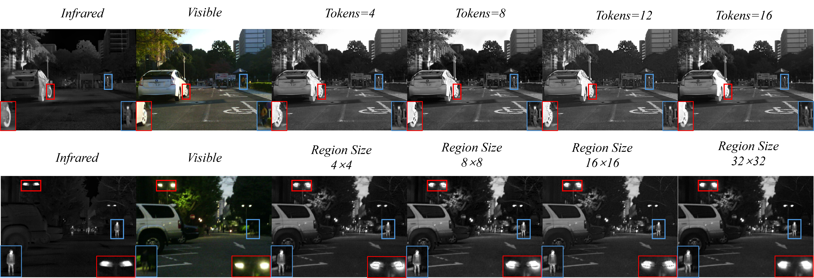

# Figure Gallery

本目录包含用户提供的“图片”文件夹中的全部 17 个文件。下面展示全部 14 个 PNG；3 个 PDF 原件列在页面末尾。文件名和图像内容未修改。

## `00004N_frequency_routing_enhancement.png`

## `feature_evolution_00581D.png`

## `MSRS_quantitative_comparison_roman.png`

## `图片1.png`

## `图片3.png`

## `图片4.png`

## `图片5.png`

## `图片6.png`

## `图片7.png`

## `图片8.png`

## `图片9.png`

## `图片10.png`

## `图片11.png`

## `图片12.png`

## PDF originals

- [`00004N_frequency_routing_enhancement.pdf`](00004N_frequency_routing_enhancement.pdf)
- [`图片5.pdf`](图片5.pdf)
- [`图片6.pdf`](图片6.pdf)
